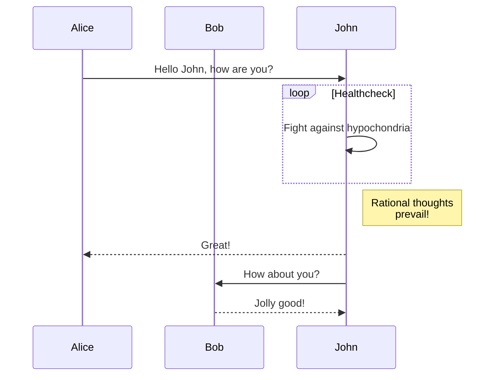

# Median string challenge

Computing the median of a set of strings is a computational hard task.
Nevertheless, this task is embedded in a number of applications in, for example,
bioinformatics and information retrieval problems. The tasks consists on, given
an alphabet \\(Alphabet\\) and a set of finite strings $S$, finding the $s$, the
median string of $S$. $s$ is defined so that the total sum of the edit distances
of $s$ to all strings in $S$ is minimized.

For computing the edit distance between two given strings, we use a table that
defines the weights of each possible operations, as follows:

where $e_s$ is the empty string and $s_1,..., s_n$ are symbols of the alphabet.
\\(v_{i, j}\\) is the weight of converting symbol $s_i$ into $s_j$.

When $a \ne 0$, there are two solutions to \\((ax^2 + bx + c = 0)\\) and they are:

$$ x = {-b \pm \sqrt{b^2-4ac} \over 2a} $$

### Normal Code

```
$ meteor shell
> import { ApiKeys, Tenants } from 'meteor/app:accessors';
> const { apiKey } = ApiKeys.findOne();
> Tenants.call('provision', { tenantName: 'acme', admin: 'joe.doe@example.com' }, { apiKey })
```
### Mermaid Code


